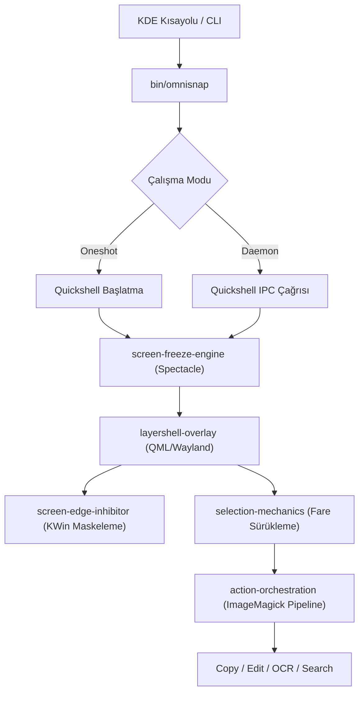

# Sistem Genel Bakışı (System Overview)

Omnisnap, **KDE Plasma 6 (Wayland / KWin)** masaüstü ortamı için tasarlanmış, Caelestia estetiğinden ve mimarisinden esinlenen bağımsız, yüksek performanslı bir ekran yakalama aracıdır.

## Mimari Temeller
Omnisnap'in sistem mimarisi dört ana bileşenin uyumuna dayanır:

1. **Wayland LayerShell Katmanı**: Standart bir pencere yerine Wayland LayerShell (`WlrLayershell.layer: WlrLayer.Overlay`) kullanılarak ekranın tüm pikselleri ve panelleri üzerine anında kilitlenen bir kullanıcı arayüzü inşa edilir ([[layershell-overlay]]).
2. **Ekran Dondurma Motoru (Screen Freeze Engine)**: Kullanıcı kısayola bastığı anda donanım seviyesinde Spectacle kullanılarak ekranın dondurulmuş bir karesi alınır ve arka plana yerleştirilir ([[screen-freeze-engine]], [[adr-001-screen-freeze-via-spectacle]]).
3. **Masaüstü Kenar Koruması**: KWin sıcak köşeleri ve genel bakış efektleri seçim esnasında geçici olarak durdurulur ([[screen-edge-inhibitor]], [[adr-003-kwin-screen-edge-inhibition]]).
4. **Çok Modlu Eylem Boru Hattı**: Seçilen alan ImageMagick aracılığıyla kırpılır ve panoya kopyalama, Swappy ile çizim yapma, Tesseract ile OCR veya Google Lens ile görsel arama eylemlerine yönlendirilir ([[action-orchestration]], [[adr-004-multimodal-post-processing-pipeline]]).

## Temel Tasarım İlkeleri
- **Sıfır C++ Eklenti Bağımlılığı**: Kod tabanı saf QML ve Linux standart CLI araçlarından (`magick`, `wl-copy`, `tesseract`, `swappy`) oluşur; harici karmaşık derleme adımları gerektirmez ([[installation-and-packaging]]).
- **Çift Yaşam Döngüsü**: Sistem hem anında çalışan tek atımlık CLI modunu hem de sıfır gecikmeli arka plan daemon modunu destekler ([[execution-lifecycles]], [[adr-002-dual-lifecycle-oneshot-and-daemon]]).
- **İşaretçi Ayrışımı**: Görsel katmanlar tıklama olaylarına karşı saydamdır; böylece fare bırakma eylemleri asla ıskalanmaz ([[selection-mechanics]], [[adr-005-layershell-pointer-transparency]]).

## İlişkili Dokümanlar
- Yaşam döngüleri: [[execution-lifecycles]]
- Çoklu monitör yönetimi: [[multi-display-topology]]
- Mimari kararlar: [[adr-001-screen-freeze-via-spectacle]], [[adr-002-dual-lifecycle-oneshot-and-daemon]]
