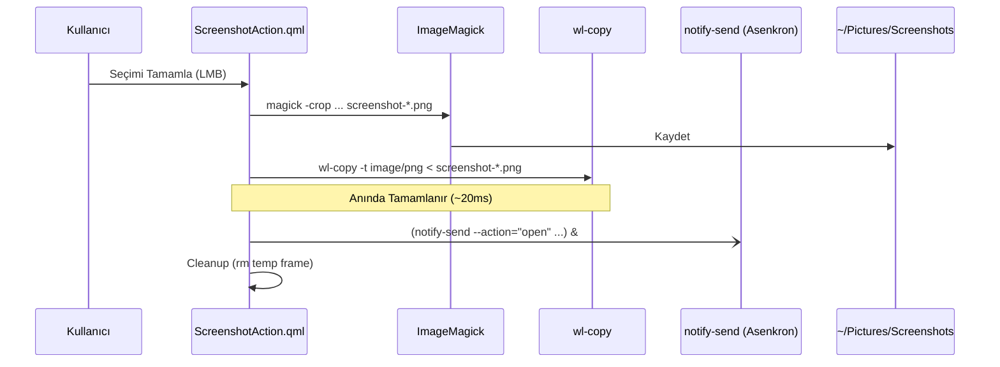

# Pano Kopyalama ve Bildirim Sistemi (Clipboard & Notifications)

Omnisnap'in en sık kullanılan varsayılan eylemi `SnipAction.Copy`, seçilen görüntüyü hem kalıcı diske kaydeder, hem Wayland panosuna kopyalar, hem de kullanıcıya zengin masaüstü aksiyonları sunan bir bildirim fırlatır.

## Boru Hattı Akışı



## Betik Uygulaması
```bash
set -euo pipefail;
SAVE_DIR='~/Pictures/Screenshots';
SAVE_DIR="${SAVE_DIR/#\~/$HOME}";
mkdir -p "$SAVE_DIR" &&
saveFile="$SAVE_DIR/screenshot-$(date +%Y-%m-%d_%H.%M.%S).png" &&
magick '$screenshotPath' -crop ... "$saveFile" &&
wl-copy -t image/png < "$saveFile";
(
    ACTION=$(notify-send "Screenshot Captured" "Saved to $saveFile" \
        -i "$saveFile" \
        -a "Omnisnap" \
        --action="open=Open" \
        --action="folder=Open Folder" 2>/dev/null || true);
    if [ "$ACTION" = "open" ]; then
        xdg-open "$saveFile";
    elif [ "$ACTION" = "folder" ]; then
        xdg-open "$SAVE_DIR";
    fi
) &
rm -f '$screenshotPath';
```

## Asenkron Alt Kabuk (`( ... ) &`) Tasarımı
Önceki sürümlerde `notify-send --action` komutu kullanıcının bildirime tıklamasını beklediği için betiğin çalışması kilitlenmekte ve dosya temizliği askıda kalmaktaydı.

Bu sorun bildirim dinleyicisini bir alt kabuğa (`( ... ) &`) sararak çözülmüştür:
1. Görsel kesilir ve `saveFile` oluşturulur.
2. `wl-copy` görüntüyü anında panoya aktarır (kullanıcı Ctrl+V yapmaya hazır hale gelir).
3. Bildirim arka plana fırlatılır. Kullanıcı dilerse "Open" ile görüntüyü varsayılan resim görüntüleyicide açabilir veya "Open Folder" ile klasöre gidebilir.
4. Ana betik bildirimi beklemeden geçici dondurma dosyasını siler ve süreci sonlandırır.

## Test Doğrulaması
`tests/test_action_pipeline.sh` içerisinde asenkron yapının hızı test edilir; `wl-copy` adımının 50 milisaniyenin altında tamamlandığı doğrulanır.

## İlişkili Dokümanlar
- Eylem orkestrasyonu: [[action-orchestration]]
- Görsel kırpma boru hattı: [[image-crop-pipeline]]
- Mimari karar: [[adr-004-multimodal-post-processing-pipeline]]
