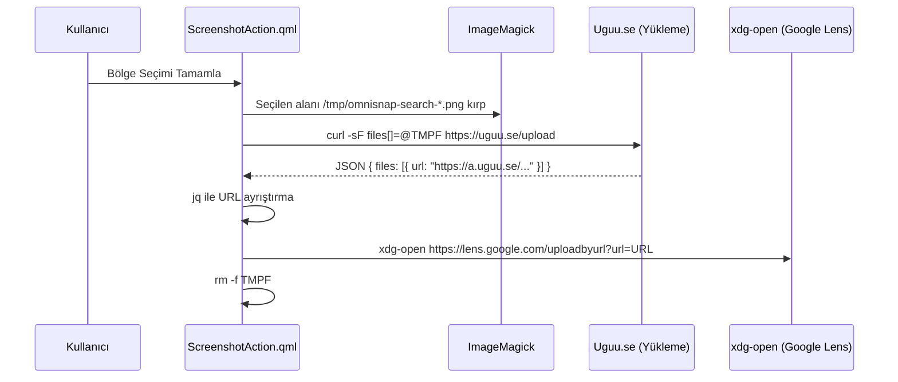

# Görsel Arama ve Google Lens Entegrasyonu (Lens Visual Search)

Omnisnap, kullanıcının ekranda seçtiği herhangi bir bölgeyi anında tersine görsel arama (reverse image search) motoruna göndermesini sağlar.

Bu eylem `SnipAction.Search` olarak adlandırılır ve şu yollarla çağrılır:
- Alt araç çubuğundaki **Google Lens** sekmesi ([[floating-toolbar]]).
- CLI komutu: `omnisnap search` veya `omnisnap -s` ([[cli-interface]]).

## Boru Hattı Mimarisi



## Betik Uygulaması
```bash
set -euo pipefail;
TMPF=$(mktemp /tmp/omnisnap-search-XXXXXX.png);
magick '$screenshotPath' -crop ... "$TMPF" &&
UPLOAD_URL=$(curl -sF files[]=@"$TMPF" 'https://uguu.se/upload' | jq -r '.files[0].url' 2>/dev/null || true);
if [ -n "$UPLOAD_URL" ] && [ "$UPLOAD_URL" != "null" ]; then
    xdg-open "https://lens.google.com/uploadbyurl?url=$UPLOAD_URL";
else
    notify-send -u critical "Search Failed" "Could not upload screenshot for image search." -a "Omnisnap" 2>/dev/null || true;
fi;
rm -f "$TMPF";
rm -f '$screenshotPath';
```

## Tasarım Tercihleri ve Güvenlik
1. **Neden Uguu API?**: Uguu, API anahtarı veya kullanıcı kaydı gerektirmeyen, geçici ve otomatik silinen (ephemeral) hafif bir dosya sunucusudur. Görseller kalıcı olarak saklanmaz.
2. **Hata Yakalama**: Ağ bağlantısının olmaması veya yükleme servisinin yanıt vermemesi durumunda `notify-send -u critical` ile kullanıcıya net bir hata mesajı verilir; tarayıcı boş bir sayfayla açılmaz.
3. **Temizlik**: Yükleme biter bitmez yerel geçici dosya `rm -f` ile silinir ([[process-lifecycle]]).

## İlişkili Dokümanlar
- Eylem orkestrasyonu: [[action-orchestration]]
- Görsel kırpma boru hattı: [[image-crop-pipeline]]
- Araç çubuğu: [[floating-toolbar]]
- Mimari karar: [[adr-004-multimodal-post-processing-pipeline]]
